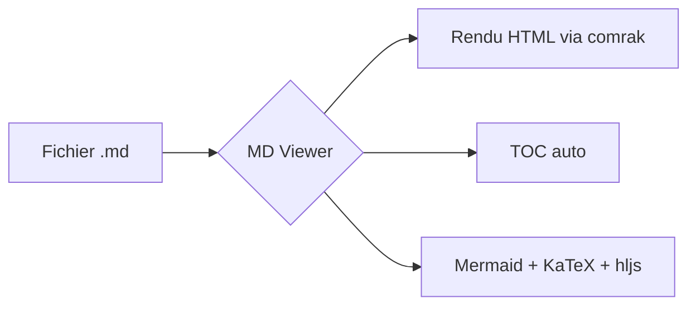

# Démo MD Viewer

Bienvenue dans **MD Viewer** — une visionneuse Markdown _complète_ écrite en **Rust** avec Tauri.

## Mise en forme

- **gras**, *italique*, ~~barré~~, `code inline`
- [lien externe](https://example.com)
- Autolink : https://github.com/MotherSphere/md-viewers

## Liste de tâches

- [x] Support GFM complet (tableaux, task lists, strikethrough)
- [x] Coloration syntaxique du code (highlight.js, 190+ langages)
- [x] Formules mathématiques (KaTeX)
- [x] Diagrammes Mermaid
- [x] Mode sombre
- [ ] Café ☕

## Code

```rust
fn fibonacci(n: u32) -> u64 {
    match n {
        0 => 0,
        1 => 1,
        _ => fibonacci(n - 1) + fibonacci(n - 2),
    }
}
```

```python
def fibonacci(n):
    a, b = 0, 1
    for _ in range(n):
        yield a
        a, b = b, a + b
```

## Tableau

| Langue     | Note | Remarque          |
|------------|:----:|-------------------|
| Français   |  10  | Langue maternelle |
| Anglais    |   8  | Fluent            |
| Klingon    |   2  | En progrès        |

## Citation

> La simplicité est la sophistication suprême.
> — *Léonard de Vinci*

## Mathématiques

Inline : $E = mc^2$ et $\sum_{i=1}^{n} i = \frac{n(n+1)}{2}$.

Bloc :

$$
\int_{-\infty}^{\infty} e^{-x^2} \, dx = \sqrt{\pi}
$$

## Diagramme Mermaid



## Note de bas de page

Voici une référence[^1].

[^1]: Et voici la note elle-même.
